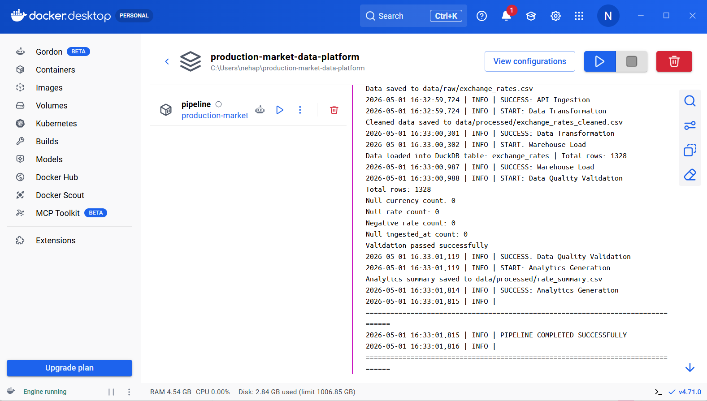

# 🏗️ Production Data Platform for Market Intelligence

End-to-end production-style data platform that ingests external API data, orchestrates workflows, validates quality, and delivers analytics through an automated pipeline system.

---

## 💼 Business Problem

Organizations rely on external API data (e.g., exchange rates) for reporting and decision-making.  
However, raw API data is:
- unstructured  
- inconsistent  
- not analytics-ready  
- lacks reliability and monitoring  

Modern data teams require automated, reliable, and production-grade pipelines to transform this data into usable insights.

---

## 💡 Solution

This project evolves a simple API pipeline into a production-ready data platform by integrating:

- Workflow orchestration  
- Containerization  
- Automated execution (CI/CD)  
- Data validation and logging  
- Scalable storage design  

---

## ⚙️ System Architecture

Exchange Rate API  
        ↓  
Ingestion (Python)  
        ↓  
Simulated Streaming Layer (event batches)  
        ↓  
Raw Storage (S3-style local storage)  
        ↓  
Airflow DAG (Orchestration)  
        ↓  
Transformation (DuckDB processing)  
        ↓  
Data Validation + Logging  
        ↓  
Analytics Layer  
        ↓  
Streamlit Dashboard  
        ↓  
CI/CD (GitHub Actions)

---

## 🔑 Key Features

- Automated data pipeline orchestrated with Apache Airflow  
- Containerized environment using Docker  
- CI/CD pipeline using GitHub Actions  
- Simulated real-time ingestion (Kafka-style batching)  
- Data transformation using DuckDB  
- Data validation and pipeline logging  
- Historical data tracking for auditability  
- Interactive analytics dashboard with Streamlit  

---

## 📊 Business Impact

- Demonstrates production-grade data engineering practices  
- Converts raw API data into analytics-ready datasets  
- Enables automated, repeatable workflows  
- Improves data reliability and monitoring  
- Simulates real-world system design used in industry  

---

## 🛠️ Tech Stack

Core Data Stack:  
Python • SQL • DuckDB • Pandas  

Data Engineering & Platform:  
Apache Airflow • Docker • GitHub Actions  

Processing & Streaming (Conceptual):  
Event-driven ingestion (Kafka-style simulation)  

Storage & Infrastructure:  
S3-style storage (local simulation) • Terraform (infrastructure-as-code concept)  

Visualization:  
Streamlit  

---

## 🐳 Docker Setup

Run the full pipeline:

docker compose up --build pipeline

Run the dashboard:

docker compose up --build dashboard

---

## 🖥️ Docker Execution Preview

The pipeline was successfully executed inside Docker, demonstrating containerized data processing and orchestration.

---

## ▶️ Run Locally (without Docker)

Activate environment:

conda activate doc_rag_project

Run pipeline:

python src/run_pipeline.py

Run dashboard:

streamlit run src/app.py

---

## 📌 Project Outcome

A fully automated data platform that:
- ingests real-time API data  
- processes and validates it  
- stores structured datasets  
- and delivers analytics through a dashboard  

---

## 🧠 Key Learnings

- Building production-style data pipelines  
- Orchestrating workflows with Airflow  
- Containerizing data systems with Docker  
- Implementing CI/CD for data pipelines  
- Designing scalable, cloud-ready architectures  